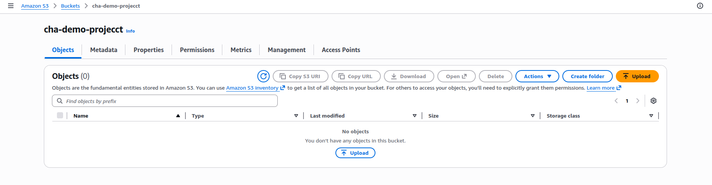
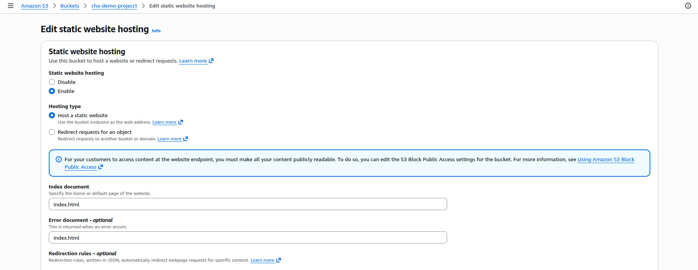
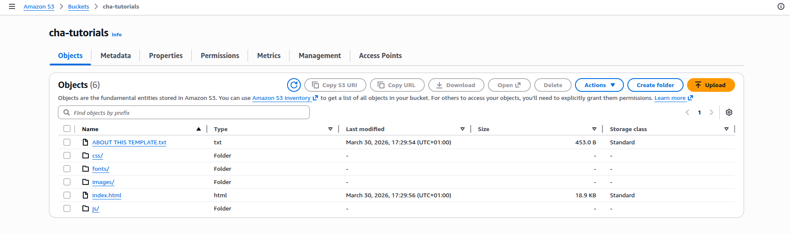

# Project 1: Hosting a Static Website on Amazon S3

## Website Link
`http://cha-tutorials.s3-website-us-east-1.amazonaws.com`

## Project Overview
This project demonstrates hands-on cloud computing by hosting a pre-built static website on Amazon S3. The repository contains the complete static website assets, including HTML, CSS, JavaScript, fonts, and images. The primary goal is to configure AWS S3 for static website hosting, upload the website content, and make the site publicly available using AWS best practices.

## Learning Objectives
- Understand how to host a static website using Amazon S3.
- Configure an S3 bucket for static website hosting and public access.
- Upload static website assets to AWS S3.
- Set the correct object permissions and metadata for web content.
- Validate the website through the S3 website endpoint.
- Learn the basic AWS CLI and AWS Management Console workflow for S3 deployment.

## Architecture
The deployment architecture for this project is intentionally simple and optimized for static web hosting:

- Amazon S3 bucket as the origin and web server.
- Static website content stored in the S3 bucket.
- S3 static website hosting endpoint to deliver content over HTTP.
- Optional: DNS routing via Amazon Route 53 or a custom domain (not required for this exercise).

The site is hosted entirely on S3, so there is no backend compute service, database, or dynamic rendering layer. This is a pure static website architecture.

## Technology Stack
- HTML5
- CSS3
- JavaScript
- Bootstrap
- Font Awesome
- Amazon S3
- AWS Management Console
- AWS CLI (optional but recommended)

## Project Contents
The repository contains the following top-level assets:

- `index.html` – main landing page
- `css/` – Bootstrap and custom CSS files
- `js/` – JavaScript libraries and custom scripts
- `fonts/` – font assets used by the site
- `images/` – site images and graphics
- `README.md` – this documentation

## Prerequisites
Before hosting the site on AWS, ensure you have the following:

- An active AWS account.
- AWS IAM user with S3 access permissions.
- AWS CLI installed and configured, or access to the AWS Management Console.
- The pre-built website files available in this repository.

## Step-by-Step Deployment on AWS S3

### 1. Create an S3 bucket
1. Open the AWS Management Console.
2. Navigate to the S3 service.
3. Choose **Create bucket**.
4. Enter a globally unique bucket name, for example: `project-1-static-site-<your-id>`.
5. Select the desired AWS Region.
6. Disable **Block all public access** or keep block public access disabled for static website hosting. Confirm the warning.
7. Leave versioning and other advanced settings at defaults for this demo.
8. Create the bucket.



### 2. Configure the bucket for static website hosting
1. In the S3 console, open your new bucket.
2. Select the **Properties** tab.
3. Scroll to **Static website hosting** and choose **Edit**.
4. Select **Enable**.
5. Set the **Index document** to `index.html`.
6. Set the **Error document** to `index.html` or `error.html` if available.
7. Save changes.



### 3. Set bucket policy for public read access
1. Open the **Permissions** tab in the S3 bucket.
2. Scroll to **Bucket policy** and choose **Edit**.
3. Add a policy allowing `s3:GetObject` for all objects in the bucket:

```json
{
  "Version": "2012-10-17",
  "Statement": [
    {
      "Sid": "PublicReadGetObject",
      "Effect": "Allow",
      "Principal": "*",
      "Action": "s3:GetObject",
      "Resource": "arn:aws:s3:::your-bucket-name/*"
    }
  ]
}
```

4. Replace `your-bucket-name` with your actual bucket name.
5. Save the bucket policy.

### 4. Upload the website files

1. Open the **Objects** tab in the S3 bucket.
2. Choose **Upload**.
3. Drag and drop the repository files and folders into the upload area.
4. Ensure the directory structure is preserved: `index.html`, `css/`, `js/`, `fonts/`, `images/`.
5. Click **Upload**.




4. Verify the files were synced correctly.

### 5. Validate uploaded content and metadata
1. In the S3 console, confirm the `index.html` object is present at the bucket root.
2. Confirm static assets are under the `css/`, `js/`, `fonts/`, and `images/` prefixes.
3. Check that each object has the correct `Content-Type` metadata, especially for `.html`, `.css`, `.js`, `.svg`, and font files.
4. AWS often sets this automatically during upload, but verify if you expect correct browser rendering.

### 6. Access the website through the S3 website endpoint
1. In the bucket **Properties** tab, under **Static website hosting**, copy the endpoint URL.
2. Open the endpoint URL in a browser.
3. Confirm the website loads correctly with styles, images, and scripts.

## Optional Enhancements
- Configure a custom domain with Amazon Route 53.
- Add an SSL/TLS certificate using AWS CloudFront.
- Set up CloudFront distribution for faster global delivery.
- Configure S3 bucket logging or analytics for traffic monitoring.

## Notes
- This project is pre-built, so no source code changes are required for hosting.
- The main objective is the deployment workflow on AWS S3.
- S3 static website hosting is appropriate for non-dynamic sites without server-side rendering.

## Troubleshooting
- If the website returns XML access denied, verify public access settings and bucket policy.
- If CSS or JS does not load, confirm the object metadata content type is correct.
- If the site returns 403 or 404 errors, ensure `index.html` is configured as the index document.

## Conclusion
This project provides a practical demonstration of using AWS S3 to host a static website. It reinforces cloud fundamentals such as S3 bucket configuration, public access policies, and deployment validation. The pre-built static files are ready to deploy immediately, making this an ideal learning exercise for AWS static website hosting.

